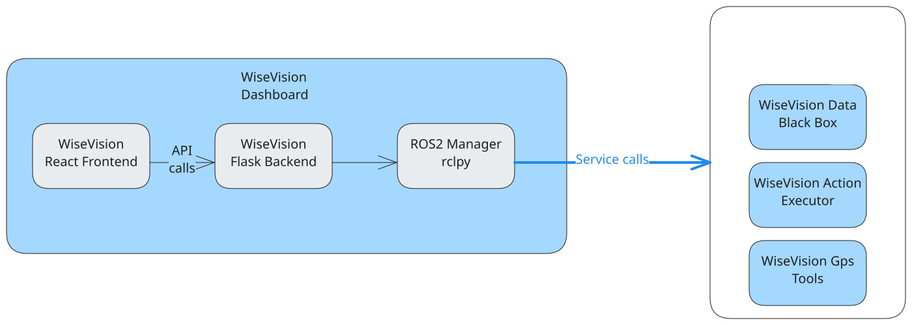

# wisevision_dashboard

WiseVision Dashboard is a web-based application designed to interact with ROS 2 services via a Flask backend. It provides a seamless interface for monitoring and managing ROS 2 nodes, topics, and actions. The system consists of a React frontend, a Flask-based API, and a ROS 2 integration layer that handles communication with various ROS2 WiseVision components.

**The architecture of the dashboard:**

## Table of contents

For more information, please refer to the following sections:

[Configure and run(Start here)](docs/CONFIGURE_AND_RUN.md)

[API Endpoints](docs/API_ENDPOINTS.md)

[Minimal example](docs/MINIMAL_EXAMPLE.md)

